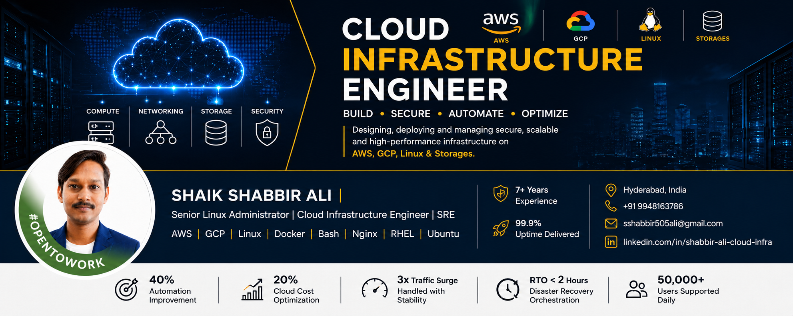

<!-- ===================== BANNER ===================== -->

  

<h1 align="center" style="font-family: Georgia, serif; letter-spacing: 1px;">SHAIK SHABBIR ALI</h1>

<i>Senior Linux Administrator &nbsp;|&nbsp; Cloud Infrastructure Engineer &nbsp;|&nbsp; SRE</i>

  📍 Hyderabad, India &nbsp; · &nbsp;
  ✆ +91 9948163786 &nbsp; · &nbsp;
  ✉ <a href="mailto:sshabbir505ali@gmail.com">sshabbir505ali@gmail.com</a> &nbsp; · &nbsp;
  <a href="https://www.linkedin.com/in/shabbir-ali-cloud-infra">LinkedIn</a>

Open to new opportunities

  

・・・・・・・・・・・・・・・・・・・・・・・・・・・・・・・・・・・・・・・・・

<!-- ===================== ABOUT ===================== -->
<table>
<tr>
<td width="30%" align="center" valign="top">
  
</td>
<td width="70%" valign="top">

### About

Senior Linux Administrator with **seven years** of experience designing, securing, and operating production infrastructure across healthcare and enterprise environments.

Hands-on background across **AWS**, **Google Cloud Platform**, and hybrid Linux systems — with a focus on automation, reliability, and disaster recovery that holds up under real-world load.

**Core competencies**
Linux Administration &nbsp;·&nbsp; AWS &nbsp;·&nbsp; GCP &nbsp;·&nbsp; Docker &nbsp;·&nbsp; Nginx &nbsp;·&nbsp; Apache &nbsp;·&nbsp; PHP-FPM &nbsp;·&nbsp; Bash Scripting &nbsp;·&nbsp; LVM &nbsp;·&nbsp; SAN/NAS &nbsp;·&nbsp; SSL &nbsp;·&nbsp; Performance Tuning &nbsp;·&nbsp; Disaster Recovery &nbsp;·&nbsp; Production Support (L2/L3)

</td>
</tr>
</table>

・・・・・・・・・・・・・・・・・・・・・・・・・・・・・・・・・・・・・・・・・

### Impact at a Glance

<table align="center">
<tr>
<td align="center" width="20%">

**40%**
 Automation Improvement

</td>
<td align="center" width="20%">

**20%**
 Cloud Cost Optimization

</td>
<td align="center" width="20%">

**3×**
 Traffic Surge Stability

</td>
<td align="center" width="20%">

**&lt; 2 hrs**
 Disaster Recovery Time

</td>
<td align="center" width="20%">

**50,000+**
 Users Supported Daily

</td>
</tr>
</table>

99.9% uptime delivered &nbsp;·&nbsp; 7+ years of production experience

・・・・・・・・・・・・・・・・・・・・・・・・・・・・・・・・・・・・・・・・・

### Technologies

| | |
|---|---|
| **Operating Systems** | Ubuntu, RHEL, CentOS, Rocky Linux |
| **AWS** | EC2, IAM, VPC, Route53, ELB, Auto Scaling, CloudWatch, S3 |
| **GCP** | Compute Engine, IAM, VPC, Cloud Storage |
| **Containers** | Docker, Docker Compose |
| **Web Servers** | Apache, Nginx, PHP-FPM |
| **Storage** | SAN, NAS, LVM, RAID, NFS |
| **Networking** | DNS, SSL/TLS, VPN, IPTables, UFW |
| **Automation** | Bash, Cron, Shell Scripting |

  

・・・・・・・・・・・・・・・・・・・・・・・・・・・・・・・・・・・・・・・・・

### Currently Learning

Kubernetes &nbsp;·&nbsp; Terraform &nbsp;·&nbsp; Infrastructure as Code &nbsp;·&nbsp; CI/CD &nbsp;·&nbsp; Cloud Security &nbsp;·&nbsp; Monitoring & Observability &nbsp;·&nbsp; Linux Performance Tuning

**Roadmap:** AWS Solutions Architect – Associate &nbsp;·&nbsp; RHCSA &nbsp;·&nbsp; Kubernetes &nbsp;·&nbsp; Terraform &nbsp;·&nbsp; Ansible

・・・・・・・・・・・・・・・・・・・・・・・・・・・・・・・・・・・・・・・・・

### GitHub Overview

  
  

  

・・・・・・・・・・・・・・・・・・・・・・・・・・・・・・・・・・・・・・・・・

### Featured Work

| Repository | Description |
|---|---|
| Linux Scripts | Linux administration & troubleshooting |
| Bash Automation | Backup & automation scripts |
| Nginx Configurations | Production Nginx configurations |
| Apache Configurations | Virtual host examples |
| PHP-FPM Tuning | PHP optimization & tuning |
| Docker Projects | Docker & Compose examples |
| AWS Infrastructure | Cloud deployment examples |
| GCP Infrastructure | Google Cloud examples |
| Monitoring Scripts | Server health monitoring |
| SSL Management | Certificate automation |

### Selected Projects

Telangana NCD &nbsp;·&nbsp; AP Medical & Health Department &nbsp;·&nbsp; AIIMS Delhi &nbsp;·&nbsp; AP108 Emergency Response &nbsp;·&nbsp; APCRDA

・・・・・・・・・・・・・・・・・・・・・・・・・・・・・・・・・・・・・・・・・

  Thank you for visiting. Building reliable Linux, cloud, and automation solutions — one system at a time.

